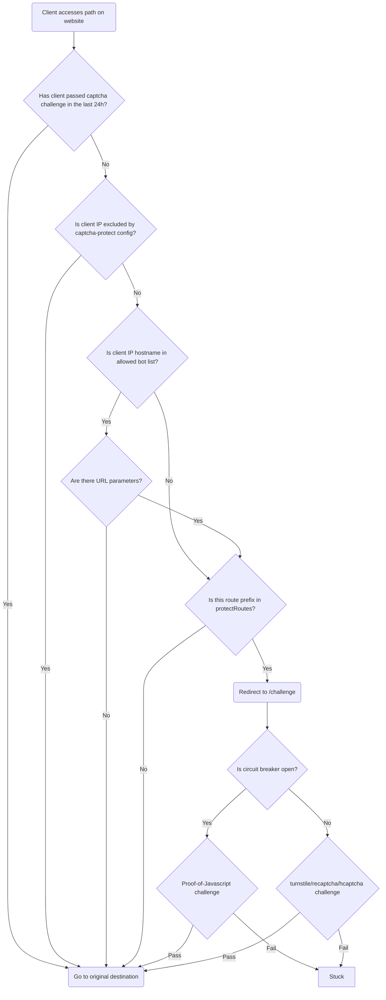

# Captcha Protect

Captcha Protect is a Traefik middleware that challenges client IPs on protected routes, using a CAPTCHA provider of your choice: Turnstile, reCAPTCHA, hCaptcha, or proof-of-javascript.

It requires Traefik `v3.6` or above.

You may have seen CAPTCHAs added to individual forms on the web to prevent bots from spamming submissions. This plugin extends that concept to your entire site, or to specific routes on your site. By default, the first protected request from a non-exempt IP is challenged. Once the CAPTCHA is successfully completed, that IP is no longer challenged during the configured cache window.

Source repository: <https://github.com/libops/captcha-protect>

## Request flow

## Documentation

- [Configuration](configuration.md) covers the Docker Compose example and configuration options.
- [Protecting multiple services](multiple-services.md) explains the preferred multi-layer routing topology and memory sizing.
- [Circuit breaker](circuit-breaker.md) explains failover to proof-of-javascript when a CAPTCHA provider is unavailable.
- [Good bots](good-bots.md) covers crawler and monitoring bypasses.
- [Challenge template](challenge-template.md) explains how to theme the challenge page.
- [Monitoring](monitoring.md) and [troubleshooting](troubleshooting.md) cover runtime inspection.
