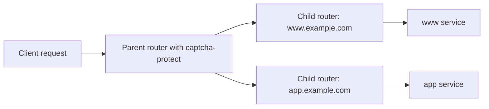

# Protecting Multiple Services

Use Traefik multi-layer routing when one `captcha-protect` policy should protect multiple sites or services. Attach `captcha-protect` to one parent router, then route accepted requests through child routers.



This is the preferred multi-service topology because the plugin runs once at the parent layer. The parent instance owns the rate, verification, and bot caches for all child routers, so memory is sized for one shared middleware instance instead of one instance per service. A 256 MB Traefik memory limit is a practical starting point for this layout; monitor memory under representative traffic and tune `window` if cache retention is too high.

!!! note
    Multi-layer routing requires Traefik `v3.6` or later. Parent routers carry `entryPoints`, TLS, and shared middleware. Child routers use `parentRefs` and define the final service.

!!! warning
    Multi-layer routing is supported by the file provider, KV providers, and Kubernetes CRD. It is not available through Docker labels, Docker Swarm labels, ECS labels, Consul Catalog tags, Nomad tags, Kubernetes Ingress, or Gateway API. If your services are discovered by one of those providers, define the parent and child routers in a file-provider dynamic config and route child services to stable backend URLs.

=== "Structured (YAML)"

    ```yaml
    http:
      routers:
        protected-sites:
          entryPoints:
            - websecure
          rule: "Host(`www.example.com`) || Host(`app.example.com`)"
          middlewares:
            - captcha-protect
          tls: {}

        www:
          rule: "Host(`www.example.com`)"
          service: www
          parentRefs:
            - protected-sites

        app:
          rule: "Host(`app.example.com`)"
          service: app
          parentRefs:
            - protected-sites

      services:
        www:
          loadBalancer:
            servers:
              - url: "http://www:80"
        app:
          loadBalancer:
            servers:
              - url: "http://app:80"

      middlewares:
        captcha-protect:
          plugin:
            captcha-protect:
              rateLimit: 0
              window: 864000
              protectRoutes:
                - "/"
              captchaProvider: turnstile
              siteKey: "<TURNSTILE_SITE_KEY>"
              secretKey: "<TURNSTILE_SECRET_KEY>"
              goodBots:
                - apple.com
                - archive.org
                - commoncrawl.org
                - duckduckgo.com
              persistentStateFile: /tmp/captcha-protect/state.json
    ```

=== "Structured (TOML)"

    ```toml
    [http.routers.protected-sites]
      entryPoints = ["websecure"]
      rule = "Host(`www.example.com`) || Host(`app.example.com`)"
      middlewares = ["captcha-protect"]
      [http.routers.protected-sites.tls]

    [http.routers.www]
      rule = "Host(`www.example.com`)"
      service = "www"
      parentRefs = ["protected-sites"]

    [http.routers.app]
      rule = "Host(`app.example.com`)"
      service = "app"
      parentRefs = ["protected-sites"]

    [http.services.www.loadBalancer]
      [[http.services.www.loadBalancer.servers]]
        url = "http://www:80"

    [http.services.app.loadBalancer]
      [[http.services.app.loadBalancer.servers]]
        url = "http://app:80"

    [http.middlewares.captcha-protect.plugin.captcha-protect]
      rateLimit = 0
      window = 864000
      protectRoutes = ["/"]
      captchaProvider = "turnstile"
      siteKey = "<TURNSTILE_SITE_KEY>"
      secretKey = "<TURNSTILE_SECRET_KEY>"
      goodBots = [
        "apple.com",
        "archive.org",
        "commoncrawl.org",
        "duckduckgo.com",
      ]
      persistentStateFile = "/tmp/captcha-protect/state.json"
    ```

=== "Labels"

    Docker and Swarm labels cannot express `parentRefs`, so labels are not a supported multi-layer routing format.

    Use labels for single-router protection only, or move the protected parent and child routers into a file-provider dynamic config. Docker services can still run on the same Docker network and be reached by their service DNS names, such as `http://www:80`.

=== "Tags"

    Consul Catalog, Nomad, and ECS tags cannot express `parentRefs`, so tags are not a supported multi-layer routing format.

    Use tags for single-router protection only, or move the protected parent and child routers into a file-provider dynamic config. KV providers are another option when you need dynamic non-file configuration with multi-layer routing.

## Operational Notes

Do not attach `captcha-protect` separately to every router for multi-service protection. Traefik plugin middleware state is instance-local, so per-router attachment duplicates rate, verification, and bot caches. The parent-router pattern keeps those caches in one middleware instance for the protected service group.

`persistentStateFile` only persists rate and verified challenge state across Traefik restarts. It is not a shared cache backend and should not be used to coordinate multiple plugin instances. If you run multiple Traefik replicas, each replica still has its own in-memory cache.

The cache implementation is expiration-based; despite its `lru` import alias in the source, it does not enforce a least-recently-used entry limit, maximum entry count, or memory limit. Enough distinct client IPs within the configured `window` can consume substantial memory. `rateLimit` controls when an IP is challenged; it does not cap the number of cached IPs.

The repository CI includes a dedicated `integration-test-multilayer-routing` job that runs the documented parent/child structure through Traefik's file provider. That test verifies that requests through one child router affect the same parent `captcha-protect` rate state used before routing to another child router.
